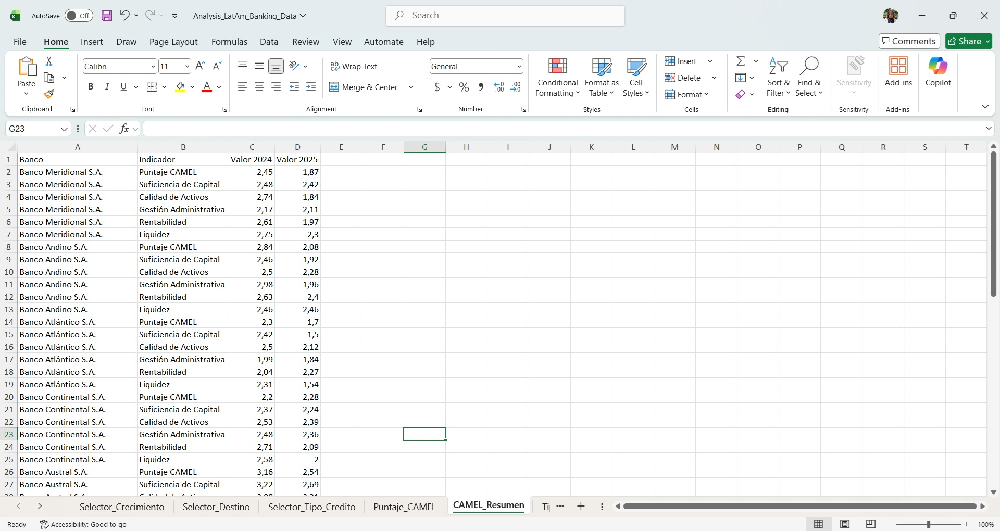
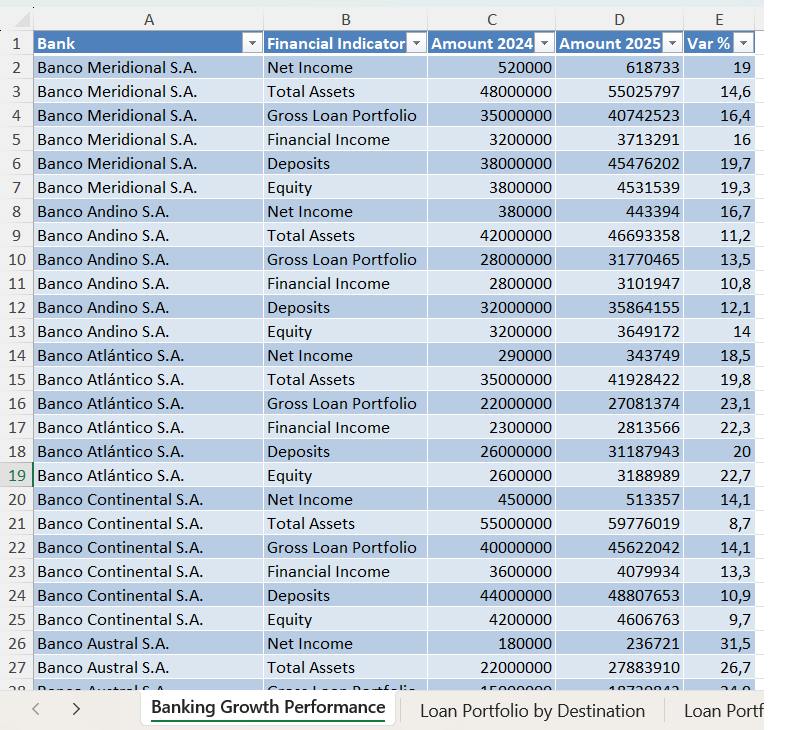
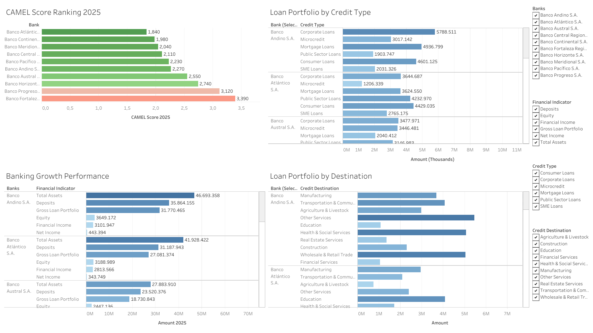

# LatAm Banking: Data Restructuring & CAMEL Performance Analysis

### [▶ View the Interactive Dashboard on Tableau Public](https://public.tableau.com/views/CAMEL_Analysis_LatAm_Banking_Data/FinancialDataRestructuringCAMELAnalysisRegionalBankingSector)

---

## Project Overview

End-to-end financial data project analyzing the performance 
and stability of 10 Latin American banks using the CAMEL 
framework (Capital Adequacy, Asset Quality, Management 
Efficiency, Earnings, Liquidity).

The project starts from raw, inconsistent financial data, 
restructures it using Power Query, builds a CAMEL scoring 
model in Excel, and delivers a fully interactive Tableau 
dashboard for executive-level performance analysis.

---

## The Problem

Raw financial data arrived in a non-tabular, inconsistent 
format — multiple sheets, unstructured layouts, merged cells, 
and mixed data types that made analysis impossible without 
significant manual work.

| | Before | After |
|---|---|---|
| Format | Non-tabular, merged cells | Clean, normalized tables |
| Usability | Cannot be analyzed | Ready for SQL, Power BI, Tableau |
| Structure | Inconsistent across banks | Standardized: Bank · Indicator · Amount 2024 · Amount 2025 · Var% |
| Time to process | 4–6 hours manually | Under 30 minutes |

---

## What I Built

### 1. Data Restructuring (Excel + Power Query)
- Extracted and standardized data from 12 different sheets
- Cleaned null values, duplicates, and inconsistent formats 
  using Power Query
- Transformed non-tabular layouts into structured, 
  analysis-ready tables
- Documented every transformation step for maintainability 
  and traceability

### 2. CAMEL Scoring Model (Excel)
Designed and applied a CAMEL scoring framework across 
5 dimensions for 10 banks, comparing 2024 vs 2025:

| Dimension | Indicator |
|---|---|
| **C** — Capital Adequacy | Suficiencia de Capital |
| **A** — Asset Quality | Calidad de Activos |
| **M** — Management Efficiency | Gestión Administrativa |
| **E** — Earnings | Rentabilidad |
| **L** — Liquidity | Liquidez |

### 3. Interactive Tableau Dashboard (4 Views)
- **CAMEL Score Ranking 2025** — Comparative bank ranking 
  by overall financial health
- **Banking Growth Performance** — YoY growth by financial 
  indicator per bank
- **Loan Portfolio by Credit Type** — Distribution across 
  Corporate, SME, Consumer, Mortgage, Microcredit, 
  and Public Sector loans
- **Loan Portfolio by Destination** — Portfolio breakdown 
  by economic sector

---

## Key Findings

- **Banco Atlántico S.A.** achieved the strongest CAMEL 
  score in 2025 (1.84), showing the most significant 
  improvement in capital adequacy and liquidity
- **Banco Fortaleza Regional** showed the weakest overall 
  score (3.39), with persistent issues in management 
  efficiency and earnings
- All 10 banks showed positive YoY growth in Total Assets, 
  with Banco Austral S.A. leading at 26.7%
- Corporate and Consumer loans dominate portfolio 
  composition across the regional banking sector

---

## Before & After

**Before restructuring:**

**After restructuring:**

**Final Dashboard:**

---

## Tools Used

| Tool | Purpose |
|---|---|
| Excel (Advanced) | Data restructuring, CAMEL scoring model |
| Power Query (M) | Data cleaning, normalization, transformation |
| Tableau | Interactive 4-view performance dashboard |

---

## Repository Contents

| File | Description |
|---|---|
| `Analysis_LatAm_Banking_Data.xlsx` | Restructured dataset + CAMEL scoring model |
| `CAMEL_Analysis_LatAm_Banking_Data.twbx` | Tableau packaged workbook |
| `Before.jpg` | Raw data structure (pre-cleaning) |
| `After.png` | Structured data (post-cleaning) |
| `Dashboard_Preview.png` | Full Tableau dashboard screenshot |

---

> **⚠️ Data Note:** Dataset synthetically generated for 
> portfolio purposes using AI-simulated financial data. 
> All restructuring logic, Power Query transformations, 
> CAMEL scoring methodology, and dashboard design were 
> independently developed.
